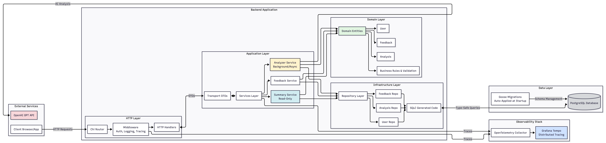
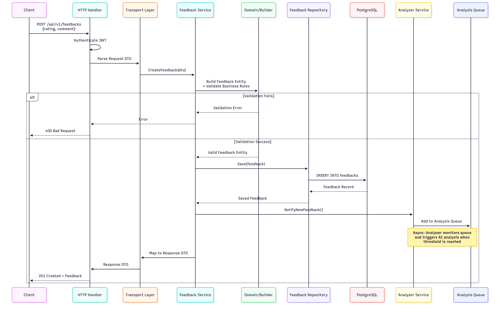
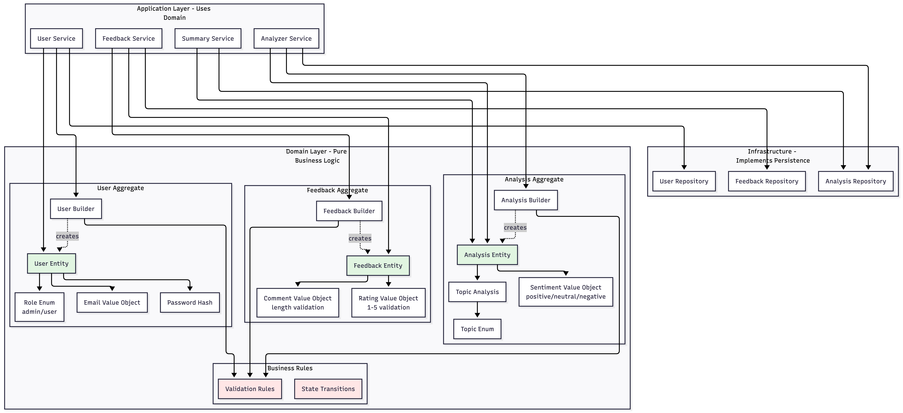
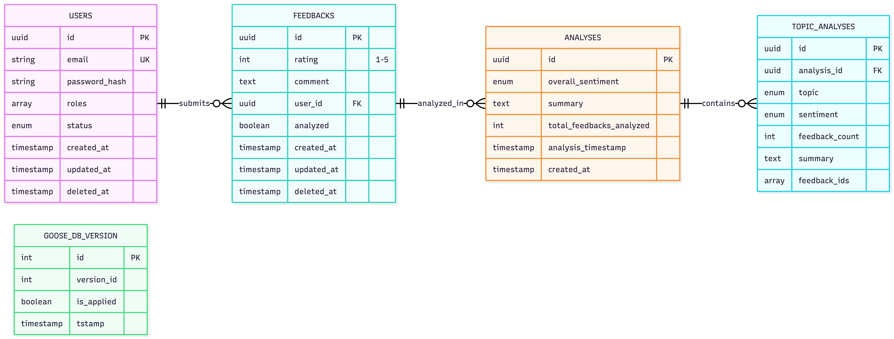
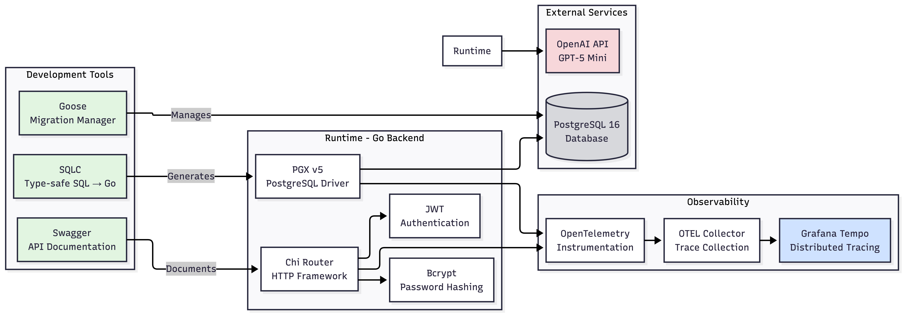
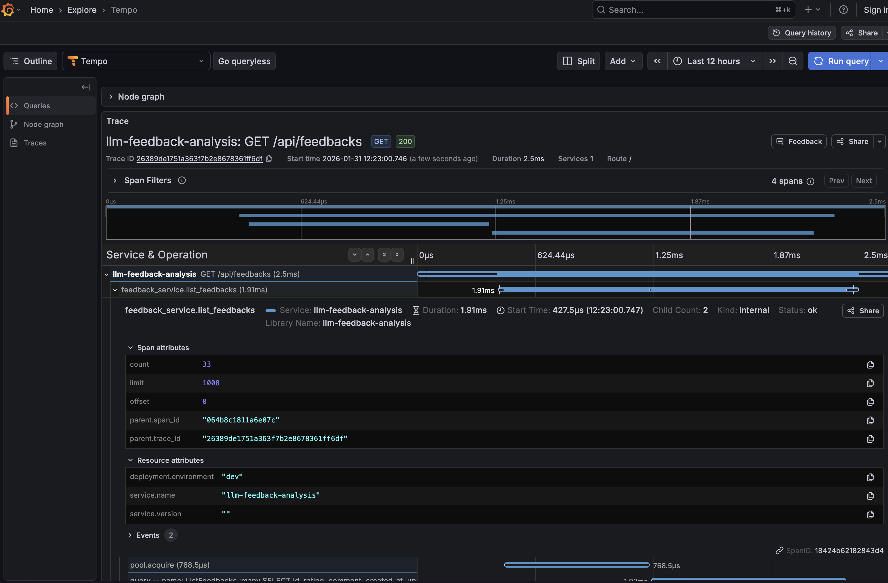

# Backend Documentation

## Table of Contents

1. [Overview](#overview)
2. [Architecture](#architecture)
3. [Design Principles](#design-principles)
4. [Layer Breakdown](#layer-breakdown)
5. [Key Technologies & Tools](#key-technologies--tools)
6. [Database Migrations](#database-migrations)
7. [LLM Analysis Design Decisions](#llm-analysis-design-decisions)
8. [Configuration](#configuration)
9. [Security Considerations](#security-considerations)
10. [Getting Started](#getting-started)
11. [API Documentation](#api-documentation)

---

## Overview

This backend module is part of a web-based feedback collection system with AI-powered analysis capabilities. It was
built to fulfill a specific task: allow users to submit feedback and provide administrators with intelligent insights
through LLM-based analysis.

The backend is built with **Go** and follows industry-standard architectural patterns to ensure maintainability,
scalability, and clear separation of concerns. It integrates with **PostgreSQL** for data persistence and **OpenAI's GPT
models** for intelligent feedback analysis.

---

## Architecture

### Clean Architecture + Domain-Driven Design

This backend combines two powerful architectural approaches:

1. **Clean Architecture with Layers** - separating code into distinct layers with clear responsibilities
2. **Domain-Driven Design (DDD)** - where the business domain comes first and drives all technical decisions

### Why This Approach?

**Clean Architecture** ensures:

- Code is organized by responsibility (what each layer does)
- Dependencies flow inward (outer layers depend on inner layers, not vice versa)
- Business logic is isolated from technical infrastructure
- Easy to test, maintain, and modify individual components

**Domain-Driven Design** ensures:

- The business rules are the heart of the application
- Technical code serves the business needs, not the other way around
- Domain entities are pure and contain all business logic
- All operations respect business rules enforced by the domain

### System Architecture Overview



*The diagram above illustrates the complete system architecture, showing how external services, application layers,
domain logic, infrastructure, and observability components interact.*

### The Flow



*This sequence diagram shows how a feedback submission request flows through all layers, from the HTTP handler through
domain validation to database persistence, and how the async analyzer is notified.*

#### Layer Flow Summary

When a request comes in, it flows through these layers:

```
HTTP Request → Handlers → Transport (DTOs) → Services → Domain (Validation) → Repository → PostgreSQL
```

And the reverse for responses:

```
PostgreSQL → Repository → Domain Entities → Services → Transport (DTOs) → Handlers → HTTP Response
```


*The clean architecture diagram shows the dependency flow: outer layers (infrastructure) depend on inner layers (
domain), never the reverse.*

---

## Design Principles

### 1. Domain First

The **domain** is designed first, before any technical implementation:

- We identify business entities (Feedback, Analysis, User)
- We define business rules (validation, state transitions)
- We create value objects (Rating, Comment, etc.)

By looking at the [domain](internal/domain/) folder, you can immediately understand:

- What entities exist in the system
- How they behave
- What business rules govern them
- How they relate to each other



*This diagram illustrates how domain aggregates (Feedback, Analysis, User) contain entities, value objects, and builders
that enforce business rules. Services use the domain, and repositories implement persistence.*

### 2. Separation by Domain Entity

Everything is organized by domain entity:

- **Repositories** are separated: `feedback/`, `analysis/`, `user/`
- **Services** are separated: `feedback/`, `analysis/`, `user/`
- **Handlers** are grouped by entity
- **Domain models** are in separate packages

This makes it easy to find related code and understand what operations are available for each entity.

### 3. Business Rules in the Domain

All creation, modification, and deletion of entities **must** go through the domain layer:

- The domain contains **builders** that enforce business rules during creation
- The domain validates all state changes
- No service or repository can bypass domain validation

This ensures data integrity and consistent business logic enforcement across the entire application.

### 4. Single Responsibility

Each layer, service, and component has **one clear responsibility**:

- Handlers handle HTTP concerns (routing, parsing, responding)
- Transport layer handles data transformation between layers
- Services handle business workflow orchestration
- Repositories handle data persistence
- Domain handles business rules and validation

---

## Layer Breakdown

### 1. Domain Layer (`internal/domain/`)

**Purpose**: Pure business logic and rules

**What it contains**:

- Entity definitions (Feedback, Analysis, User)
- Value objects (Rating, Comment, Email, etc.)
- Business validation rules
- Builders for entity creation
- Business-level methods (not persistence or HTTP)

**Why it's pure**: The domain has **no dependencies** on external libraries, databases, or HTTP frameworks. It only
contains business concepts. This means:

- Business rules can't be accidentally bypassed
- Easy to test without mocking infrastructure
- Domain logic can be easily understood by people outside of development
- Can be reused in different contexts (CLI, gRPC, etc.)

**Example**: The Feedback domain defines what a valid feedback looks like, what ratings are acceptable (1-5), comment
length limits, etc.

### 2. Handlers Layer (`internal/app/handlers/`)

**Purpose**: Input layer that receives and responds to HTTP requests

**What it contains**:

- HTTP route definitions
- Request parsing and validation
- Response formatting
- Middleware (authentication, logging, etc.)
- Swagger annotations for API documentation

**Responsibilities**:

- Accept HTTP requests
- Extract data from requests (body, params, headers)
- Call appropriate service methods
- Format service results as HTTP responses
- Handle HTTP-level errors (404, 400, 500, etc.)

**What it does NOT do**:

- Business logic (that's in services)
- Database operations (that's in repositories)
- Data transformation logic (that's in transport layer)

### 3. Transport Layer (`internal/app/transport/`)

**Purpose**: Communication between layers using Data Transfer Objects (DTOs)

**What it contains**:

- Request DTOs (structures that represent incoming data)
- Response DTOs (structures that represent outgoing data)
- Transformation logic between DTOs and domain entities

**Why we need it**:

- HTTP requests/responses have different structures than domain entities
- Domain entities might contain sensitive data we don't want to expose
- API clients need stable contracts that don't change when domain changes
- Validation tags for request parsing (JSON, form data, etc.)

**Example**: A `CreateFeedbackRequest` DTO might have `rating` and `comment` fields that get transformed into a domain
`Feedback` entity after validation.

### 4. Services Layer (`internal/app/services/`)

**Purpose**: Business workflow orchestration and execution

**What it contains**:

#### a) **Feedback Service** (`services/feedback/`)

- Create new feedback entries
- Retrieve feedback by ID
- List feedback with pagination
- Delete feedback
- Coordinates between handlers and repository

#### b) **Analyzer Service** (`services/analysis/`)

- **Asynchronous background service** that runs continuously
- Monitors for new feedback accumulation
- Triggers AI analysis when thresholds are met (configurable)
- **Write-only** for analysis data (creates new analyses)
- Manages AI API calls to OpenAI
- Handles token estimation and context window management
- Implements rate limiting and debouncing (optional)

**Key design decision**: The analyzer runs **asynchronously** because:

- AI analysis can be slow (seconds to minutes)
- Don't want to block user feedback submission
- Can batch multiple feedbacks for more meaningful analysis
- Allows rate limiting to control OpenAI API costs

#### c) **Analysis/Feedback Summary Service**

- **Read-only** service for querying processed analyses
- Retrieves analysis results from database
- Provides statistics and summaries
- Lists topic clusters and sentiment analysis

**Key design decision**: Separate read/write services because:

- **Analyzer Service** has exclusive write permissions for analyses
- **Summary Service** only reads, ensuring data integrity
- Clear separation of concerns: who can modify vs. who can query
- Prevents accidental data corruption
- Makes it obvious where analysis data originates

### 5. Repository Layer (`internal/app/repository/`)

**Purpose**: Data persistence abstraction

**What it contains**:

- Repository interfaces (contracts)
- PostgreSQL implementations
- SQLC-generated code for type-safe queries
- Transaction management

**Why abstraction matters**:

- Business logic doesn't know about SQL or database specifics
- Can swap PostgreSQL for another database with minimal changes
- Easy to mock for testing
- Separates "what to persist" from "how to persist"

**Organization by entity**:

- `postgres/feedback/` - Feedback persistence
- `postgres/analysis/` - Analysis persistence
- `postgres/user/` - User persistence

### 6. External Layer (`internal/app/external/`)

**Purpose**: Integration with external services

**What it contains**:

- LLM client (OpenAI integration)
- Schema definitions for AI requests/responses
- Error handling for external API calls

---

## Key Technologies & Tools

### SQLC - Type-Safe SQL Query Generation

**What it is**: A tool that generates Go code from SQL queries

**How it works**:

1. You write SQL queries in `.sql` files
2. You define the expected inputs and outputs
3. SQLC reads your queries and generates Go functions
4. Generated code is 100% type-safe

**Why we use it**:

- ✅ **No runtime SQL errors** - queries are validated at build time
- ✅ **Type safety** - compiler catches mismatches between Go and SQL
- ✅ **No manual mapping** - SQLC generates row-to-struct mapping
- ✅ **Performance** - uses native `database/sql`, no ORM overhead
- ✅ **Productivity** - write SQL, get Go code automatically
- ✅ **Community trusted** - widely adopted in the Go community

**Alternative approaches and why we didn't use them**:

- **ORMs (GORM, etc.)**: Add complexity, hide SQL, performance overhead
- **Manual query writing**: Error-prone, time-consuming, type-unsafe
- **Query builders**: Adds performance overhead, still need to maintain mapping code

**Example workflow**:

```sql
-- queries/feedback.sql
-- name: CreateFeedback :one
INSERT INTO feedback.feedbacks (rating, comment, user_id)
VALUES ($1, $2, $3)
RETURNING *;
```

SQLC generates:

```go
func (q *Queries) CreateFeedback(ctx context.Context, arg CreateFeedbackParams) (Feedback, error)
```

You get autocomplete, type checking, and guaranteed correctness.

### Goose - Database Migration Management

**What migrations are**:
Migrations are an industry standard approach of managing the schema of the DB. They are SQL files that evolve your
database schema over time. Each migration is a step in your database's history:

- Migration 1: Create users table
- Migration 2: Add email column to users
- Migration 3: Create indexes for performance

**Why migrations are essential**:

- 📝 **Schema as Code** - Database structure lives in version control
- 🔄 **Reproducible** - Any developer can recreate the exact database state
- 🚀 **Deployable** - Production databases can be updated automatically
- ⏮️ **Reversible** - Can roll back changes if something goes wrong
- 👥 **Collaborative** - Team can see how schema evolved over time
- 🔧 **Required for SQLC** - SQLC needs the schema to generate code

**Why Goose specifically**:

- ✅ **Industry standard** in the Go ecosystem
- ✅ **Simple** - Just SQL files with metadata
- ✅ **Reliable** - Tracks which migrations have run
- ✅ **Up and Down** - Supports both forward and rollback migrations
- ✅ **Community maintained** - Active development and support

**Our migrations** (in chronological order):

1. `20260129000000_create_feedback_table.sql` - Initial feedback storage
2. `20260130000000_create_user_table.sql` - User authentication
3. `20260130000001_add_user_id_to_feedbacks.sql` - Link feedback to users
4. `20260130000002_create_default_admin_user.sql` - Demo admin account
5. `20260130000003_create_analysis_tables.sql` - AI analysis storage
6. `20260130000004_add_topic_enum.sql` - Topic categorization



*Entity-relationship diagram showing the database schema with users, feedbacks, analyses, and topic_analyses tables,
along with their relationships and key fields.*

**How it works**:

- Goose tracks applied migrations in a `goose_db_version` table
- Each migration runs exactly once
- Migrations run in order based on timestamp prefix
- **Migrations are automatically applied at application startup** - no manual intervention needed
- If a migration fails, fix the issue and restart the application

### Swagger - Automated API Documentation

**What it is**: A tool that generates interactive API documentation from code comments

**How it works**:

1. You add structured comments to your handler functions
2. Swagger reads these comments
3. Generates OpenAPI specification (JSON/YAML)
4. Creates interactive documentation UI

**Why we use it**:

- 📚 **Auto-generated** - Documentation stays in sync with code
- 🔄 **Single source of truth** - No separate docs to maintain
- 🧪 **Testable** - Can try API calls directly from the docs
- 📥 **Importable** - Works with Postman, Insomnia, etc.
- 👥 **Frontend friendly** - Frontend developers can see exactly what APIs exist
- 🎯 **Accurate** - Can't forget to update docs when code changes

**Benefits of layer separation**:
Because we separate handlers from business logic:

- Annotations are isolated in the handler layer
- Clean and organized (not mixed with business code)
- Easy to find and update API documentation
- Business logic stays pure and focused

**Generated documentation includes**:

- Endpoints (URL paths)
- HTTP methods (GET, POST, PUT, DELETE)
- Request/response schemas
- Authentication requirements
- Example requests and responses
- Error codes

**Access the docs** (when server is running):

- Swagger UI: `http://localhost:8080/swagger/index.html`
- OpenAPI JSON: `http://localhost:8080/swagger/doc.json`

### JWT - JSON Web Tokens for Authentication

**What it is**: A secure way to transmit authentication information

**How it works**:

1. User logs in with credentials
2. Server validates and creates a JWT token
3. Token is sent to client
4. Client includes token in subsequent requests
5. Server verifies token signature and extracts user info

**Why we use it**:

- 🔒 **Stateless** - No session storage on server
- ⚡ **Fast** - Just signature verification, no database lookup
- 📱 **Scalable** - Works across multiple servers
- 🔐 **Secure** - Cryptographically signed, tamper-proof
- ⏰ **Time-limited** - Tokens expire automatically

**Configuration**:

- **Secret key**: Must be at least 32 characters (set via `JWT_SECRET` env var)
- **Algorithm**: HS256 (HMAC with SHA-256)
- **Expiration**: 24 hours (configurable)

### Technology Stack Overview



*Complete overview of development tools (SQLC, Goose, Swagger), runtime components (Chi, PGX, JWT), external services (
OpenAI, PostgreSQL), and observability stack (OpenTelemetry, Tempo).*

---

## Database Migrations

### What Are Migrations?

Think of migrations as a **version control system for your database schema**. Just like Git tracks code changes,
migrations track database structure changes.

### Why Migrations Matter

**Without migrations**:

- ❌ Developer A creates a table manually
- ❌ Developer B doesn't know about it
- ❌ Production database is different from development
- ❌ No way to recreate database structure
- ❌ Deployments require manual SQL execution

**With migrations**:

- ✅ All schema changes are in code
- ✅ Every developer has the same database structure
- ✅ Production updates are automated
- ✅ Can recreate database from scratch anytime
- ✅ Clear history of how schema evolved

### Schema as Code

"Schema as Code" is an industry-standard practice that means:

- Database structure is defined in code files
- Structure is version-controlled (Git)
- Changes are reviewed like code (Pull Requests)
- Automated deployment of schema changes
- Disaster recovery - can rebuild database from code

This is **not optional** in modern development—it's a **must-have**.

### Our Migration Strategy

**File naming convention**: `YYYYMMDDHHMMSS_description.sql`

- Timestamp ensures migrations run in order
- Description explains what the migration does

**Each migration has two parts**:

- `+goose Up` - Apply the change (create table, add column, etc.)
- `+goose Down` - Reverse the change (drop table, remove column, etc.)

**Example**:

```sql
-- +goose Up
CREATE TABLE feedback.feedbacks
(
    id         UUID PRIMARY KEY,
    rating     INTEGER   NOT NULL,
    comment    TEXT      NOT NULL,
    created_at TIMESTAMP NOT NULL
);

-- +goose Down
DROP TABLE feedback.feedbacks;
```

### Why This Is Required for SQLC

SQLC needs to **analyze your database schema** to generate type-safe code:

- SQLC reads your tables, columns, and types
- Generates Go structs that match your schema
- Creates functions with correct parameter types
- Validates that your queries are correct

Without migrations defining the schema, SQLC can't do its job.

---

## LLM Analysis Design Decisions

### Overview

The AI analysis system is designed to provide **contextual, incremental insights** into user feedback over time. Rather than analyzing all feedback from scratch with each new submission, the system maintains **historical context** while processing new feedback in **manageable batches**.

This approach balances:
- **AI quality** - Enough context for meaningful insights
- **Cost efficiency** - Controlled API usage and token limits
- **Scalability** - Can handle thousands of feedbacks without exponential costs
- **Reliability** - Fault-tolerant design with tracking for potential retries

### Database Schema Design

The analysis system uses **four related tables** to track the complete analysis lifecycle:

#### 1. `analyses` Table - Analysis Metadata

**Purpose**: Stores high-level analysis results and overall insights

**Structure**:
```sql
CREATE TABLE feedback.analyses (
    id                         UUID PRIMARY KEY,
    overall_sentiment          feedback.sentiment_enum NOT NULL,
    summary                    TEXT NOT NULL,
    total_feedbacks_analyzed   INTEGER NOT NULL,
    analysis_timestamp         TIMESTAMP NOT NULL,
    created_at                 TIMESTAMP NOT NULL
);
```

**Why this structure:**
- `overall_sentiment` - Aggregate sentiment across all analyzed feedbacks (positive/neutral/negative)
- `summary` - LLM-generated overview of feedback trends and key insights
- `total_feedbacks_analyzed` - Count of feedbacks included in this analysis
- `analysis_timestamp` - When the analysis was performed (distinct from `created_at` for audit)

**Design rationale:**
- Provides a **snapshot in time** of feedback state
- Allows tracking **how sentiment evolves** over multiple analyses
- Enables **historical comparison** - "How did sentiment change from last week?"
- Separates analysis metadata from topic-level details

#### 2. `topic_analyses` Table - Topic Clustering Results

**Purpose**: Breaks down each analysis into specific topics identified by the LLM

**Structure**:
```sql
CREATE TABLE feedback.topic_analyses (
    id              UUID PRIMARY KEY,
    analysis_id     UUID NOT NULL REFERENCES feedback.analyses(id),
    topic           feedback.topic_enum NOT NULL,
    sentiment       feedback.sentiment_enum NOT NULL,
    feedback_count  INTEGER NOT NULL,
    summary         TEXT NOT NULL,
    feedback_ids    UUID[] NOT NULL,
    created_at      TIMESTAMP NOT NULL
);
```

**Why this structure:**
- `analysis_id` - Links to parent analysis (one-to-many relationship)
- `topic` - Category identified by LLM (e.g., Performance, UI/UX, Bugs, Features)
- `sentiment` - Sentiment **specific to this topic** (may differ from overall)
- `feedback_count` - Number of feedbacks categorized under this topic
- `summary` - LLM-generated summary for this specific topic
- `feedback_ids` - Array of feedback UUIDs assigned to this topic

**Design rationale:**
- **Topic-level granularity** - Sentiment may be positive for "UI/UX" but negative for "Performance"
- **Drill-down capability** - Admins can click a topic to see associated feedbacks
- **Flexible categorization** - One feedback can appear in multiple topics (via `feedback_ids` array)
- **Summary per topic** - Detailed insights for each theme

#### 3. `feedback_analysis_assignments` Table - Analysis Tracking

**Purpose**: Maps which feedbacks were included in which analyses

**Structure**:
```sql
CREATE TABLE feedback.feedback_analysis_assignments (
    id          UUID PRIMARY KEY,
    feedback_id UUID NOT NULL REFERENCES feedback.feedbacks(id),
    analysis_id UUID NOT NULL REFERENCES feedback.analyses(id),
    created_at  TIMESTAMP NOT NULL,
    UNIQUE(feedback_id, analysis_id)
);
```

**Why this table exists:**

This is a **critical reliability feature** that solves several problems:

1. **Tracking analyzed feedbacks**: Maintains a record of which feedbacks were included in each analysis
2. **Network partition recovery**: If the analyzer crashes after calling OpenAI but before saving results, we can identify:
   - Feedbacks that were sent to the LLM
   - Results that were never persisted
   - Which feedbacks need to be reanalyzed
3. **Retry logic foundation**: Enables future enhancement:
   ```sql
   -- Find feedbacks that weren't successfully analyzed
   SELECT f.* FROM feedback.feedbacks f
   WHERE f.analyzed = true  -- Marked as analyzed
   AND NOT EXISTS (
       SELECT 1 FROM feedback.feedback_analysis_assignments faa
       WHERE faa.feedback_id = f.id
   );  -- But not in any analysis assignment
   ```
4. **Audit trail**: Complete history of which feedbacks were analyzed together
5. **Analysis reproducibility**: Can recreate the exact set of feedbacks used in any analysis

**Future improvement potential:**
While the current system doesn't implement automatic retry logic, this table provides the foundation for:
- Detecting incomplete analyses
- Reanalyzing feedbacks that failed due to transient errors
- Validating analysis completeness at service startup
- Recovering from crashes or network failures

**Design rationale:**
- **Idempotency support** - Prevent duplicate analysis of same feedbacks
- **Fault tolerance** - System can recover gracefully from failures
- **Debugging** - Can trace exactly what was analyzed when
- **Many-to-many relationship** - Feedbacks can theoretically be reanalyzed in future iterations

#### 4. `feedback_topic_assignments` Table - Topic-Feedback Mapping

**Purpose**: Explicitly maps which feedbacks belong to which topics

**Structure**:
```sql
CREATE TABLE feedback.feedback_topic_assignments (
    id              UUID PRIMARY KEY,
    feedback_id     UUID NOT NULL REFERENCES feedback.feedbacks(id),
    topic_analysis_id UUID NOT NULL REFERENCES feedback.topic_analyses(id),
    created_at      TIMESTAMP NOT NULL,
    UNIQUE(feedback_id, topic_analysis_id)
);
```

**Why this table exists:**

While `topic_analyses.feedback_ids` stores feedback UUIDs in an array, this table provides:

1. **Efficient querying**: 
   ```sql
   -- Get all feedbacks for a topic (indexed query)
   SELECT f.* FROM feedback.feedbacks f
   JOIN feedback.feedback_topic_assignments fta ON f.id = fta.feedback_id
   WHERE fta.topic_analysis_id = 'topic-uuid';
   ```
   vs. array scanning: `WHERE 'feedback-uuid' = ANY(feedback_ids)` (slower)

2. **Reverse lookups**: Find all topics a feedback belongs to
   ```sql
   SELECT ta.* FROM feedback.topic_analyses ta
   JOIN feedback.feedback_topic_assignments fta ON ta.id = fta.topic_analysis_id
   WHERE fta.feedback_id = 'feedback-uuid';
   ```

3. **Database normalization**: Follows relational database best practices
4. **Indexing capability**: Can create indexes on both `feedback_id` and `topic_analysis_id`
5. **Statistics**: Easy to count assignments, detect overlaps, etc.

**Design rationale:**
- **Performance** - Faster joins than array operations
- **Scalability** - Handles thousands of feedbacks efficiently
- **Flexibility** - Easy to add metadata (e.g., confidence scores) later
- **Standard relational pattern** - Many-to-many relationship via junction table

### Incremental Analysis with Historical Context

#### The Challenge: Infinite Feedback History

As feedback accumulates over time, we face a **token limit problem**:
- With 100,000 feedbacks, we can't send all to the LLM each time
- OpenAI has context window limits (e.g., 128K tokens for GPT-4)
- Cost scales linearly with tokens sent
- Processing time increases dramatically

**Naive approach (doesn't scale):**
```
Analysis 1: Analyze feedbacks 1-7
Analysis 2: Analyze feedbacks 1-14 (regenerate everything)
Analysis 3: Analyze feedbacks 1-21 (regenerate everything)
...
Analysis 100: Analyze feedbacks 1-700 (700 feedbacks × 200 tokens = 140K tokens!)
```

#### Our Solution: Aggregation with Context Preservation

Instead, we use **incremental analysis** with **historical summary context**:

```
Analysis 1: 
  - New feedbacks: 1-7
  - Previous context: None
  - Output: Summary + topics

Analysis 2:
  - New feedbacks: 8-14
  - Previous context: Summary from Analysis 1
  - Output: Updated summary + topics (considers previous trends)

Analysis 3:
  - New feedbacks: 15-21
  - Previous context: Summary from Analysis 2
  - Output: Updated summary + topics (builds on previous insights)
```

**How it works:**

1. **Fetch latest analysis**: Retrieve the most recent `analyses.summary` and `topic_analyses`
2. **Provide context to LLM**: Include previous summary in the prompt:
   ```
   Previous analysis summary:
   - Overall sentiment: Positive
   - Key topics: Performance (negative), UI (positive), Features (neutral)
   - Summary: Users appreciate UI improvements but report performance issues...
   
   New feedbacks to analyze (7 new submissions):
   1. "Still seeing memory leaks..." (rating: 2)
   2. "Love the new dashboard!" (rating: 5)
   ...
   ```

3. **LLM generates updated analysis**: 
   - Considers both previous trends and new feedback
   - Can identify if sentiment is improving/declining
   - Detects new emerging topics
   - Updates existing topic summaries

4. **Save new analysis**: Store as separate analysis record (preserves history)

**Benefits:**
- ✅ **Bounded token usage** - Only send ~7-50 feedbacks per analysis + previous summary
- ✅ **Historical awareness** - LLM understands overall trends
- ✅ **Cost efficient** - Linear cost growth instead of exponential
- ✅ **Scalable** - Works with millions of feedbacks
- ✅ **Traceable** - Complete analysis history preserved

**Configuration:**
```yaml
llm_analysis:
  min_new_feedbacks_for_analysis: 7    # Batch size for new feedbacks
  max_feedbacks_in_context: 50         # Upper limit per analysis
```

### Analysis Workflow Example

**Scenario**: 14 feedbacks submitted over time

**First Analysis (feedbacks 1-7):**
```sql
-- What gets saved:
INSERT INTO analyses (overall_sentiment, summary, total_feedbacks_analyzed)
VALUES ('negative', 'Users report performance issues...', 7);

INSERT INTO topic_analyses (analysis_id, topic, sentiment, summary, feedback_ids)
VALUES 
  (analysis_id, 'Performance', 'negative', 'Memory leaks and crashes...', ARRAY[uuid1, uuid2, uuid3]),
  (analysis_id, 'UI', 'positive', 'Users love the new design...', ARRAY[uuid4, uuid5]);

INSERT INTO feedback_analysis_assignments (feedback_id, analysis_id)
VALUES (uuid1, analysis_id), (uuid2, analysis_id), ...; -- 7 rows

INSERT INTO feedback_topic_assignments (feedback_id, topic_analysis_id)
VALUES 
  (uuid1, topic_perf_id),  -- Feedback 1 → Performance topic
  (uuid2, topic_perf_id),  -- Feedback 2 → Performance topic
  (uuid4, topic_ui_id);    -- Feedback 4 → UI topic
```

**Second Analysis (feedbacks 8-14):**
```sql
-- Analyzer retrieves:
SELECT summary, overall_sentiment FROM analyses 
ORDER BY analysis_timestamp DESC LIMIT 1;
-- Result: "Users report performance issues..." + 'negative'

-- Sends to LLM:
{
  "previous_analysis": {
    "sentiment": "negative",
    "summary": "Users report performance issues...",
    "topics": ["Performance (negative)", "UI (positive)"]
  },
  "new_feedbacks": [
    {"rating": 4, "comment": "Performance is better now!"},
    {"rating": 5, "comment": "Loving the improvements"},
    ...
  ]
}

-- LLM responds:
{
  "overall_sentiment": "positive",  // Changed from negative!
  "summary": "Sentiment has improved. Earlier performance issues appear resolved...",
  "topics": [
    {
      "name": "Performance",
      "sentiment": "positive",  // Was negative, now positive
      "summary": "Users report performance improvements..."
    },
    {
      "name": "UI",
      "sentiment": "positive",
      "summary": "Continued positive feedback on design..."
    }
  ]
}

-- Saves new analysis (separate record)
INSERT INTO analyses (...) VALUES (...);  // New UUID, new timestamp
```

### Why This Design Works

**Problem**: How to analyze thousands of feedbacks without exponential costs?

**Solution**: Incremental aggregation with context propagation

**Key insights:**

1. **Summaries compress information**: 
   - 7 feedbacks (1,400 tokens) → Summary (200 tokens)
   - Previous context stays bounded (~200-500 tokens)
   - New feedbacks vary (7-50 × ~200 tokens)
   - Total: ~1,500-10,500 tokens per analysis (manageable)

2. **LLMs are good at synthesis**:
   - Can integrate new information with previous summary
   - Detect trends (improving vs. declining)
   - Update topic sentiments based on new data

3. **Historical preservation**:
   - Each analysis is immutable (never overwritten)
   - Can track sentiment evolution: negative → neutral → positive
   - Audit trail of how feedback changed over time

4. **Fault tolerance**:
   - `feedback_analysis_assignments` tracks what was analyzed
   - Can detect and recover from incomplete analyses
   - Foundation for retry logic

5. **Query flexibility**:
   - `feedback_topic_assignments` enables efficient topic drilling
   - Can show "all feedbacks about Performance"
   - Can show "all topics a specific feedback belongs to"

### Future Enhancements

While not currently implemented, the schema supports:

**1. Analyze orphaned feedbacks:**
```sql
-- At service startup, check for orphaned feedbacks
SELECT f.id FROM feedback.feedbacks f
WHERE f.analyzed = true
AND NOT EXISTS (
    SELECT 1 FROM feedback.feedback_analysis_assignments faa
    WHERE faa.feedback_id = f.id
);
-- Re-analyze these feedbacks
```

**2. Partial failure recovery:**
- If OpenAI call succeeds but database save fails
- Mark feedbacks as "pending reanalysis"
- Retry on next analyzer cycle

**3. Analysis versioning:**
- Store multiple analyses for same feedbacks
- Compare LLM performance over time
- A/B test different prompts

**4. Confidence scores:**
- Add `confidence` column to `feedback_topic_assignments`
- Track how certain LLM is about topic assignment
- Filter low-confidence assignments

**5. Time-series analysis:**
- Query analyses by date range
- Generate trend graphs (sentiment over weeks/months)
- Detect sudden sentiment shifts

### Summary

The analysis table design reflects careful consideration of:
- **Scalability** - Handle thousands of feedbacks efficiently
- **Cost management** - Bounded token usage via aggregation
- **Reliability** - Track and recover from failures
- **Context preservation** - Maintain historical awareness
- **Query performance** - Efficient topic and feedback lookups
- **Future extensibility** - Foundation for advanced features

This architecture enables **high-quality AI insights** without exponential costs or complexity as the feedback database grows.

### Model Selection: GPT-5 Mini

**Model Used**: `gpt-5-mini-2025-08-07`

**Why GPT-5 Mini?**

For this feedback analysis use case, we selected GPT-5 Mini for several strategic reasons:

#### 1. **Token Efficiency** - Primary Driver

GPT-5 Mini is specifically optimized for cost-efficient text processing:
- **Input tokens**: $0.25 per 1M tokens (10x cheaper than GPT-5)
- **Cached input**: $0.025 per 1M tokens (100x cheaper for repeated context)
- **Output tokens**: $2.00 per 1M tokens

For our incremental analysis workflow:
```
Typical analysis request:
- Previous summary (cached): ~300 tokens × $0.025/1M = negligible
- New feedbacks: 7-50 feedbacks × 200 tokens = 1,400-10,000 tokens × $0.25/1M = $0.0003-$0.0025
- Response: ~500 tokens × $2.00/1M = $0.001

Total per analysis: ~$0.001-$0.003 (sub-cent cost)
```

With GPT-5 standard, costs would be **10x higher** for the same analysis quality.

#### 2. **Sufficient Capabilities for Text Analysis**

Our task is **structured text interpretation**, not heavy reasoning:
- ✅ **Categorization** - Assign feedbacks to predefined topics
- ✅ **Summarization** - Generate concise summaries of feedback themes
- ✅ **Sentiment analysis** - Determine positive/negative/mixed sentiment
- ✅ **Pattern recognition** - Identify common complaints or praise

We **don't need**:
- ❌ Complex multi-step reasoning
- ❌ Advanced code generation
- ❌ Mathematical problem solving
- ❌ Long-form content creation

GPT-5 Mini excels at these well-defined text analysis tasks, making it the perfect fit.

#### 3. **Speed**

GPT-5 Mini is marked as "Fast" in OpenAI's model lineup:
- Faster response times than full GPT-5
- Reduces latency in async analysis workflow
- Enables quicker feedback analysis cycles

#### 4. **Large Context Window**

Despite being "mini", it offers:
- **400,000 token context window** - More than enough for our bounded analysis batches
- **128,000 max output tokens** - Far exceeds our typical 500-token summaries

Our typical usage:
- Context needed: ~1,500-10,500 tokens per analysis
- Context available: 400,000 tokens
- **Headroom**: 40-260x more than needed

#### 5. **Modern Knowledge**

- **Knowledge cutoff**: May 31, 2024
- **Reasoning token support**: Available for enhanced analysis if needed
- Up-to-date with latest capabilities

#### Model Configuration Flexibility

While GPT-5 Mini is the **default** for optimal cost/performance, the system is **fully configurable**:

**To use a different model**, update `config.yaml`:
```yaml
llm_analysis:
  openai_model: "gpt-4o"  # or any supported OpenAI model
```

**Reference**: See [OpenAI Models Documentation](https://platform.openai.com/docs/models/gpt-5-mini) for latest pricing and capabilities.

#### OpenAI API Integration: Structured Outputs & Responses API

Our integration with OpenAI leverages two key technologies for **reliability and performance**:

##### 1. Structured Outputs

We use OpenAI's [Structured Outputs](https://platform.openai.com/docs/guides/structured-outputs) feature to enforce a strict JSON schema on the LLM's response.

**How it works**:
```go
// schema.go - Define expected structure
requestBody := Map{
    "model": c.model,
    "input": [...],
    "text": Map{
        "format": Map{
            "type":   "json_schema",
            "name":   "feedback_analysis",
            "strict": true,  // Enforces schema compliance
            "schema": AnalysisSchema(),  // Predefined structure
        },
    },
}
```

**Benefits**:
- ✅ **Guaranteed format** - Every response matches our expected structure
- ✅ **No parsing errors** - JSON is always valid and schema-compliant
- ✅ **Type safety** - Fields are always present with correct types
- ✅ **No retry logic needed** - First response is always usable
- ✅ **Reduced latency** - No need to validate or re-request

**Schema definition** (see `internal/app/external/llm/schema.go`):
```json
{
  "overall_summary": "string",
  "sentiment": "positive" | "mixed" | "negative",
  "key_insights": ["string"],
  "topics": [
    {
      "topic_enum": "product_functionality_features" | ...,
      "summary": "string",
      "feedback_ids": ["uuid"],
      "sentiment": "positive" | "mixed" | "negative"
    }
  ]
}
```

**Why this matters**:
- Traditional LLM integrations often get malformed JSON, requiring retry logic
- Structured Outputs **guarantees** valid, schema-compliant responses
- Eliminates an entire class of integration bugs
- Makes the system more reliable and predictable

##### 2. Responses API (Synchronous)

We use OpenAI's [Responses API](https://platform.openai.com/docs/api-reference/responses).

**Key characteristics**:
- **Synchronous**: Single HTTP request, get complete response immediately
- **No streaming**: Results returned in one payload when processing completes
- **Simpler integration**: No need to handle server-sent events or partial responses
- **Reliable**: Either succeeds with full response or fails with clear error

**API endpoint**:
```
POST https://api.openai.com/v1/responses
```

**Request structure**:
```go
// openai.go - Make synchronous request
httpReq, err := http.NewRequestWithContext(
    ctx,
    "POST",
    "https://api.openai.com/v1/responses",
    bytes.NewReader(requestBody),
)
```

**Perfect for our use case**:
- Analysis is **async background job** - don't need real-time streaming
- Want complete results in one response
- Simpler code, fewer edge cases
- Standard HTTP client

**Full integration flow**:
```
1. Build JSON payload with feedbacks + previous analysis
2. POST to /v1/responses with structured output schema
3. Wait for complete response (typically 2-3 seconds)
4. Parse guaranteed-valid JSON
5. Save to database
```

**Error handling**:
- HTTP errors (rate limits, auth, etc.) → Retry with backoff
- API errors (invalid request) → Log and skip analysis
- Schema violations → **Impossible** (structured outputs guarantee compliance)

**Reference**: See [OpenAI Structured Outputs Guide](https://platform.openai.com/docs/guides/structured-outputs) and [Responses API Documentation](https://platform.openai.com/docs/api-reference/responses) for full details.

#### Performance Validation

In practice, GPT-5 Mini has proven to be:
- ✅ Accurate at categorizing feedbacks into predefined topics
- ✅ Consistent in sentiment analysis
- ✅ Capable of generating coherent, useful summaries
- ✅ Reliable in handling batch analysis workflows
- ✅ Fast for real-time analysis needs

**Note**: GPT-5 Nano could be also used, but it has lower capabilities and may struggle with nuanced text analysis. GPT-5 Mini strikes the right balance.

**Conclusion**: GPT-5 Mini is the **optimal choice** for this use case—delivering high-quality text analysis at a fraction of the cost and with faster response times. The model can be easily swapped if requirements change, but for feedback analysis, it's hard to beat.

---

## Configuration

### Configuration Files

The backend uses **two configuration sources**:

#### 1. `config.yaml` - Application Configuration

**Purpose**: Non-sensitive application settings

**Location**: `backend/config.yaml`

**Committed to Git**: ✅ Yes (safe to share)

**What it contains**:

- Server settings (host, port)
- Database connection (DSN template)
- Pagination defaults
- Tracing configuration
- JWT settings (algorithm, expiration)
- LLM analysis thresholds and limits

**Ready to use**: The configuration in the repository is **ready to use as-is**. You only need to adjust it if you want
to customize behavior.

**Key settings explained**:

```yaml
server:
  port: 8080  # HTTP server port

pagination:
  limit: 100  # Max items per page

llm_analysis:
  min_new_feedbacks_for_analysis: 7  # Trigger analysis after 7 new feedbacks
  max_feedbacks_in_context: 50       # Include up to 50 feedbacks in analysis
  max_tokens_per_request: 5000        # Prevent exceeding OpenAI context limits
  openai_model: "gpt-5-mini-2025-08-07"  # AI model to use
  enable_debounce: false              # Optional rate limiting
```

#### 2. `.env` - Secrets and Environment Variables

**Purpose**: Sensitive configuration (API keys, secrets)

**Location**: `backend/.env`

**Committed to Git**: ❌ **NO** - Listed in `.gitignore`

**Why it's not committed**:

- Contains sensitive data
- Would expose API keys to anyone with repository access
- Different values for development/production
- Security best practice

**Required environment variables**:

```dotenv
# JWT token signing secret (must be 32+ characters)
# Generate with: openssl rand -base64 64
JWT_SECRET=your_jwt_secret_key_here

# OpenAI API key for LLM analysis
# Get from: https://platform.openai.com/api-keys
LLM_ANALYSIS_OPENAI_API_KEY=your_openai_api_key_here
```

**How to create your `.env` file**:

1. Copy the example file:
   ```bash
   cp .env.example .env
   ```

2. Generate a JWT secret:
   ```bash
   openssl rand -base64 64
   ```

3. Get an OpenAI API key:
    - Go to https://platform.openai.com/api-keys
    - Create a new API key
    - Copy the key

4. Edit `.env` and replace the placeholder values

**Without this file, the system will NOT work** - the application requires these secrets to start.

### Configuration Loading

The application loads configuration in this order:

1. Read `config.yaml`
2. Read `.env` file
3. Override with environment variables (if set)

This allows flexibility:

- Development: Use `.env` file
- Docker: Use environment variables
- Production: Use secret management system

---

## Security Considerations

### Default Admin User - ⚠️ For Demo Only

**What it is**: A pre-created admin account with hard-coded credentials

**Credentials** (from migration):

- Email: `admin@mail.com`
- Password: `adminpass`
- Role: `admin`

**Why it exists**: This is a **demonstration system**. The default admin allows quick testing
without additional setup.

### ⚠️ NOT Production Ready

**Keep in mind that this approach is NOT suitable for production**, because:

**Security issues**:

- ❌ Credentials are in the codebase (version control)
- ❌ Everyone with code access knows the admin password
- ❌ Can't be rotated without code changes
- ❌ Same credentials across all environments

**Production best practices**:

1. **Initial admin generation**:
    - Application generates admin credentials on first startup
    - Credentials are random and strong
    - Output to secure storage (HashiCorp Vault, AWS Secrets Manager, etc.)
    - Or display once in logs during setup (then cleared)

2. **Setup workflow**:
    - Admin logs in with generated credentials
    - Admin creates their own account with secure password
    - Admin grants themselves permissions
    - Initial admin account is deleted or disabled

3. **Never in code**:
    - No credentials in migrations
    - No credentials in config files
    - No credentials in environment variables (for initial admin)
    - Use proper secret management systems

**Example production flow**:

```
1. Deploy application
2. App generates: admin_e7f8g9h0@system.local / RandomP@ssw0rd!xyz123
3. Secret saved to: vault://production/initial-admin
4. Admin retrieves secret from vault
5. Admin logs in, creates personal account
6. Admin deletes initial account
```

### Other Security Features

**Password hashing**:

- Uses bcrypt (industry standard)
- Automatically salted
- Computationally expensive (prevents brute force)

**JWT tokens**:

- Cryptographically signed
- Time-limited expiration
- Can't be forged without secret key

**Database**:

- Parameterized queries (prevents SQL injection)
- Connection string from environment (not hardcoded)

---

## Getting Started

### Prerequisites

- Go 1.21 or higher
- PostgreSQL 14 or higher
- Docker and Docker Compose (for easy setup)
- OpenAI API account and key

### Quick Start with Docker

1. **Clone the repository**
   ```bash
   git clone <repository-url>
   cd llm-feedback-analysis/backend
   ```

2. **Create `.env` file**
   ```bash
   cp .env.example .env
   # Edit .env and add your secrets
   ```

3. **Start services**
   ```bash
   docker-compose up
   ```

4. **Access the application**
    - API: http://localhost:8080
    - Swagger docs: http://localhost:8080/swagger/index.html

### Manual Setup

1. **Install dependencies**
   ```bash
   go mod download
   ```

2. **Install development tools** (optional - only needed if modifying queries/docs)
   ```bash
   # SQLC (query generation - only if you modify SQL queries)
   go install github.com/sqlc-dev/sqlc/cmd/sqlc@latest
   
   # Swagger (API docs - only if you modify handler annotations)
   go install github.com/swaggo/swag/cmd/swag@latest
   ```

   **Note**: Goose is not required as migrations run automatically at startup.

3. **Start PostgreSQL**
   ```bash
   docker run -d \
     --name postgres \
     -e POSTGRES_PASSWORD=postgres \
     -e POSTGRES_DB=feedback_db \
     -p 5432:5432 \
     postgres:16
   ```

4. **Generate code** (if you modify queries or handlers)
   ```bash
   sqlc generate
   swag init -g cmd/main.go
   ```

5. **Run the application**
   ```bash
   go run cmd/main.go
   ```

   **Note**: Database migrations are automatically applied when the application starts. You don't need to run `goose up`
   manually.

### Login as Admin

Use the default admin credentials:

- Email: `admin@mail.com`
- Password: `adminpass`

**POST** `/api/v1/auth/login` with:

```json
{
  "email": "admin@mail.com",
  "password": "adminpass"
}
```

You'll receive a JWT token. Include it in subsequent requests:

```
Authorization: Bearer <your-token>
```

---

## API Documentation

### Swagger UI

The API documentation is **automatically generated** from code annotations.

**Access it**:

- URL: http://localhost:8080/swagger/index.html
- Interactive: Try API calls directly from the browser
- Schemas: See request/response structures

### Regenerating Documentation

If you modify handler annotations:

```bash
swag init -g cmd/main.go
```

This updates:

- `docs/docs.go`
- `docs/swagger.json`
- `docs/swagger.yaml`

### Key Endpoints

**Authentication**:

- `POST /api/v1/auth/register` - Create new user account
- `POST /api/v1/auth/login` - Login and get JWT token

**Feedback** (requires authentication):

- `POST /api/v1/feedbacks` - Submit feedback
- `GET /api/v1/feedbacks` - List feedback (paginated)
- `GET /api/v1/feedbacks/:id` - Get specific feedback
- `DELETE /api/v1/feedbacks/:id` - Delete feedback (admin only)

**Analysis** (admin only):

- `GET /api/v1/analyses` - List all analyses
- `GET /api/v1/analyses/latest` - Get most recent analysis
- `GET /api/v1/analyses/:id` - Get specific analysis

**Topics** (admin only):

- `GET /api/v1/topics` - Get all predefined topics with statistics (feedback count, average rating)
- `GET /api/v1/topics/:topic_enum` - Get detailed topic information with all associated feedbacks

---

## Project Structure Overview

```
backend/
├── cmd/
│   └── main.go                    # Application entry point
│
├── internal/
│   ├── domain/                    # 🏛️ PURE BUSINESS LOGIC (no dependencies)
│   │   ├── feedback/              # Feedback entity, rules, validation
│   │   ├── analysis/              # Analysis entity, rules, validation
│   │   └── user/                  # User entity, rules, validation
│   │
│   └── app/
│       ├── handlers/              # 🌐 INPUT LAYER (HTTP)
│       │   └── http/
│       │       ├── middleware/    # Authentication, logging, etc.
│       │       └── v1/            # API v1 handlers
│       │
│       ├── transport/             # 📦 DTOs (Request/Response objects)
│       │   ├── requests/          # Incoming data structures
│       │   └── responses/         # Outgoing data structures
│       │
│       ├── services/              # ⚙️ BUSINESS WORKFLOWS
│       │   ├── feedback/          # Feedback CRUD operations
│       │   ├── analysis/          # AI analysis (async, write-only)
│       │   └── user/              # User management
│       │
│       ├── repository/            # 💾 DATA PERSISTENCE
│       │   └── postgres/          # PostgreSQL implementations
│       │       ├── feedback/      # Feedback repository
│       │       ├── analysis/      # Analysis repository
│       │       └── user/          # User repository
│       │
│       ├── external/              # 🌍 EXTERNAL SERVICES
│       │   └── llm/               # OpenAI integration
│       │
│       └── infrastructure/        # 🔧 TECHNICAL INFRASTRUCTURE
│           └── jwt/               # JWT token handling
│
├── migrations/                    # 📊 DATABASE SCHEMA EVOLUTION
│   ├── 20260129000000_create_feedback_table.sql
│   ├── 20260130000000_create_user_table.sql
│   └── ...                        # (Goose migrations)
│
├── pkg/                           # 📚 REUSABLE PACKAGES
│   ├── errors/                    # Custom error handling
│   ├── http/                      # HTTP utilities
│   ├── log/                       # Logging infrastructure
│   └── repository/                # Repository abstractions
│
├── docs/                          # 📖 AUTO-GENERATED API DOCS
│   ├── swagger.json               # OpenAPI spec (JSON)
│   └── swagger.yaml               # OpenAPI spec (YAML)
│
├── config.yaml                    # ⚙️ Application configuration
├── .env.example                   # 🔐 Environment variables template
├── .env                           # 🔐 Secrets (not for commit)
├── docker-compose.yml             # 🐳 Local development setup
└── go.mod                         # 📦 Go dependencies
```

---

## Design Decisions Summary

### Why Clean Architecture?

- ✅ Maintainable - Easy to find and modify code
- ✅ Testable - Can test each layer independently
- ✅ Flexible - Can swap implementations (database, HTTP framework)
- ✅ Scalable - Can grow without becoming spaghetti code

### Why Domain-Driven Design?

- ✅ Business-focused - Domain reflects real business concepts
- ✅ Clear rules - Business logic is explicit and validated
- ✅ Understandable - Non-developers can understand domain code
- ✅ Maintainable - Business changes are isolated to domain layer

### Why SQLC?

- ✅ Type-safe SQL without ORM overhead
- ✅ Write actual SQL (full control)
- ✅ Zero runtime errors for queries
- ✅ Community trusted

### Why Goose?

- ✅ Industry standard for Go projects
- ✅ Schema as code (version controlled)
- ✅ Required for SQLC
- ✅ Reproducible database state

### Why Swagger?

- ✅ Auto-generated from code
- ✅ Always up-to-date
- ✅ Interactive testing
- ✅ Frontend integration

### Why Separate Read/Write Services for Analysis?

- ✅ Clear ownership - Only analyzer writes
- ✅ Data integrity - Prevents accidental modification
- ✅ Separation of concerns - Reading ≠ Writing
- ✅ Explicit design - Easy to understand who does what

### Why Asynchronous Analysis?

- ✅ Don't block users - Feedback submission is fast
- ✅ Batching - Analyze multiple feedbacks together
- ✅ Cost control - Rate limiting and debouncing
- ✅ Better insights - More context = better AI analysis

---

## Conclusion

This backend is built with best practices in mind:

- ✅ Clean, layered architecture
- ✅ Domain-driven design
- ✅ Type-safe database operations
- ✅ Automated schema management
- ✅ Auto-generated API documentation
- ✅ Clear separation of concerns
- ✅ Industry-standard tools and patterns

The code is organized to be **maintainable, testable, and scalable**. Each layer has a clear purpose, and business logic
is protected in the domain layer. This makes it easy to understand, modify, and extend the system as requirements
evolve.

---

## Observability & Distributed Tracing

The backend includes a complete observability stack using **OpenTelemetry** and **Grafana Tempo** for distributed
tracing.

### Why Observability Matters

- **Performance monitoring** - Track request latency across all layers
- **Debugging** - See exactly where time is spent in each request
- **Dependency analysis** - Understand database query performance
- **Error tracking** - Identify where failures occur in the call chain
- **Production insights** - Real-time visibility into system behavior

### Tracing Implementation

The application automatically instruments:

- ✅ HTTP requests (Chi router)
- ✅ Service layer calls
- ✅ Database queries (PGX PostgreSQL driver)
- ✅ External API calls (OpenAI)

Every request generates a **trace** that shows:

- Total request duration
- Time spent in each layer (handler → service → repository → database)
- Database query execution time
- Parent-child span relationships

### Grafana Tempo Screenshot



*Screenshot showing a distributed trace in Grafana Tempo for a GET /api/feedbacks request. The trace spans 2.5ms total
and shows the breakdown: HTTP handler (0µs), service layer (624µs), feedback list query (1.19ms), and database pool
acquisition (768µs). Notice the hierarchical span structure showing the complete request flow through all layers.*

### Access Tracing UI

When running with Docker Compose:

- **Grafana Tempo**: Go to http://localhost:3200 and search for Data Source `Tempo`
- **Paste the trace ID** from application logs to view detailed traces
- **Traces are automatically collected** via OpenTelemetry Collector
- **No additional configuration needed** - works out of the box

### Configuration

Tracing can be configured in `config.yaml`:

```yaml
tracing:
  enabled: true
  otel_endpoint: http://otel-collector:4318
  tempo_endpoint: http://tempo:3200
  service_name: llm-feedback-analysis
```

Set `enabled: false` to disable tracing (not recommended for production).
